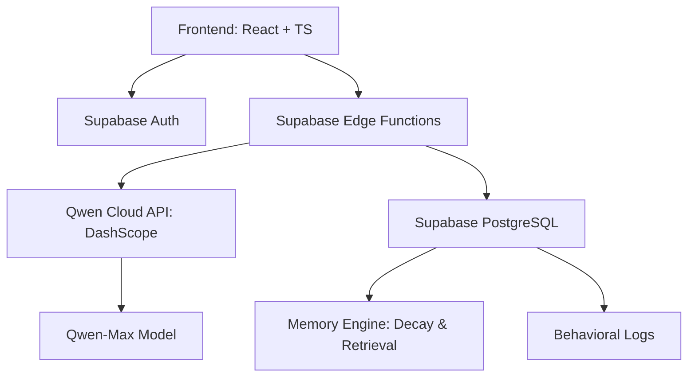

# Anchor ⚓ — MemoryAgent

**A Memory-Powered AI Accountability Companion for the Global AI Hackathon.**

Anchor is a production-grade Memory Agent built on **Alibaba Cloud Qwen-Max**. It helps users overcome unhealthy habits through persistent memory, behavioral learning, and adaptive support.

## 🏆 Hackathon Track: MemoryAgent

Anchor satisfies the MemoryAgent requirements by implementing:
- **Persistent Cross-Session Memory**: Remembers goals, triggers, and identity anchors.
- **Intelligent Retrieval & Decay**: Uses a weighted priority system to retrieve relevant context while allowing minor details to decay over time.
- **Behavioral Learning**: Adapts conversation style and suggestions based on user feedback and historical success.

## 🏗 Architecture

## 🧠 Memory Engine
Anchor uses a sophisticated retrieval algorithm:
- **Importance**: High-score memories (Identity Anchors) never decay.
- **Recency**: Recently used memories gain temporary priority.
- **Reinforcement**: Frequently referenced memories become "Core Memories."

## 🚀 Tech Stack
- **LLM**: Qwen-Max (Alibaba Cloud)
- **Backend**: Supabase (PostgreSQL, Edge Functions)
- **Frontend**: React, Tailwind CSS, Framer Motion
- **Deployment**: Vercel & Alibaba Cloud

## ⚖️ License
MIT License — Open Source for the Global AI Hackathon.