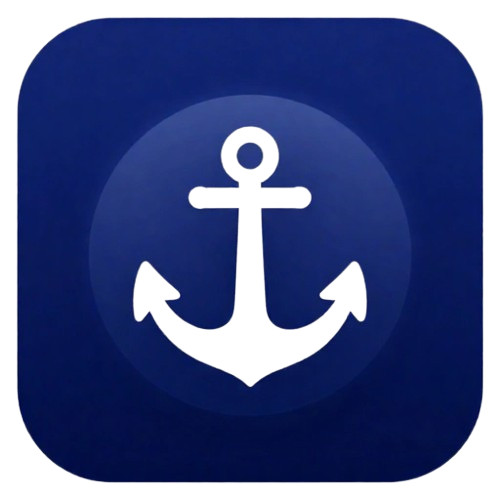
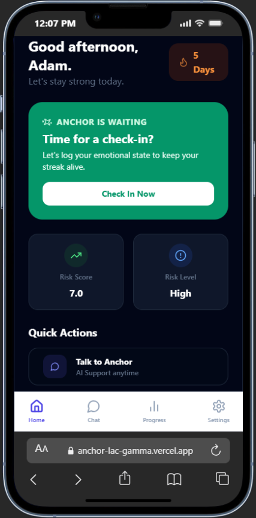
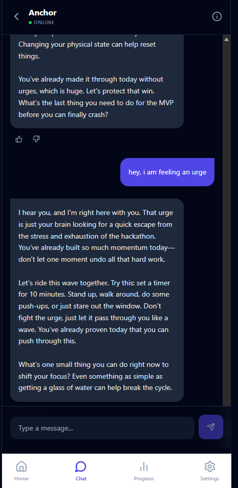
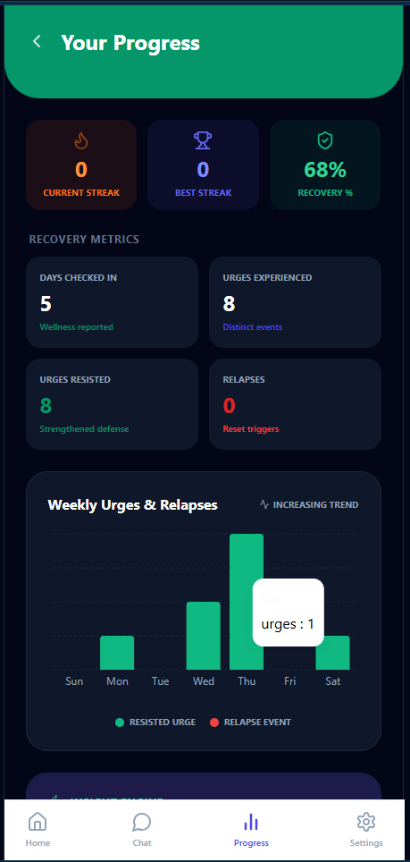
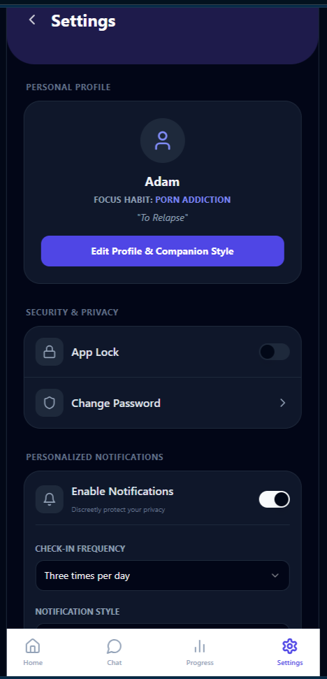

# ⚓ Anchor — Behavioral MemoryAgent

**A Private, Memory-Powered Accountability Companion built with Alibaba Cloud Qwen-Max.**

> *"Anchor doesn't simply remember conversations, it remembers meaningful progress."*
> *"Anchor communicates with Alibaba Cloud Qwen models through the DashScope Workspace OpenAI-compatible API."*



## 🛡️ Badges

### Global AI Hackathon_MemoryAgent & Alibaba Cloud_Qwen

| Global AI Hackathon_MemoryAgent | Alibaba Cloud_Qwen |
| :---: | :---: |
|  |  |

---

## 🌍 Global AI Hackathon — Track 1: MemoryAgent

Anchor is a privacy-first AI accountability companion that combines persistent memory, behavioral learning, and adaptive support to help people build healthier habits over time. Unlike conventional habit trackers, Anchor distinguishes between wellness check-ins, urges, resisted urges, and relapses to provide more meaningful insights.

## 🧠 Memory Engine

Every conversation follows a complete memory lifecycle:

• Retrieve relevant memories
• Reason with Alibaba Cloud Qwen
• Reinforce confirmed memories
• Store new experiences
• Decay outdated memories

This allows Anchor to continuously learn while keeping its context focused and efficient.

### Autonomous Memory Lifecycle

Anchor continuously:

- Stores meaningful user experiences
- Retrieves only relevant memories
- Reinforces confirmed memories
- Gradually forgets outdated information through memory decay

This enables long-term personalized support while maintaining an efficient context window.
---

## 📱 Application Interface

### 🏠 Home Dashboard & 💬 AI Chat Companion
| Home Dashboard | AI Chat Companion |
| :---: | :---: |
|  |  |

### 📈 Progress Analytics & ⚙️ Privacy Settings
| Progress Analytics | Privacy Settings |
| :---: | :---: |
|  |  |

## 🎥 Demo

Live Demo:
https://dev-sphere-kappa.vercel.app/

Demo Video:
(Coming Soon)
---

## ✨ Core Features

- 🧠 **Persistent Behavioral Memory:** Remembers goals, triggers, and identity statements across sessions.
- ⚓ **Redefined Urge Logging:** Distinguishes between wellness check-ins ("No urge") and actual urge events (Intensity 1-5).
- 🤖 **Qwen-Max Intelligence:** Powered by Alibaba Cloud’s high-performance models via the DashScope API.
- 📈 **Segregated Metrics:** Separate tracking for Days Checked In, Urges Experienced, Urges Resisted, and Relapses.
- 🔒 **Security-First Design:** Features an inactivity-based PIN Lock and strict Row-Level Security (RLS).
- 🔔 **Discreet Support:** Custom notification chimes and personalized companion styles (Supportive, Neutral, or Coaching).

---

## 🏗️ Technical Architecture

Anchor uses a **Tri-Stage Intelligence Loop**:

```text
+-----------------------------------------------------+
       |                  User Interfaces                    |
       |  (Home, Settings, Redefined Urge Logger, Progress)  |
       +-----------------------------------------------------+
          |                      |                      |
          | 1. Log Wellness /    | 2. Complete Check-In | 3. Send Chat
          |    Urge Event        |                      |    Message
          v                      v                      v
+-------------------+  +-------------------+  +--------------------+
|  [urge_logs]      |  | [behavioral_logs] |  |  [chat_messages]   |
|  [relapse_logs]   |  |                   |  |  (Memory Retrieval)|
+-------------------+  +-------------------+  +--------------------+
          |                      |                      |
          +----------------------+----------------------+
                                 |
                                 v  (Secure HTTP Handshake)
                     +-----------------------+
                     |  evaluate-user        |  <-- Powered by Qwen-Max
                     |  Edge Function        |
                     +-----------------------+
                                 |
                                 v  (Updates State Columns)
                       +------------------+
                       | [profiles] Table |
                       +------------------+
                                 |
                                 v  (Real-Time Dynamic UI)
                    +------------------------+
                    | Progress Live Charts & |
                    | AI Recommendation Card |
                    +------------------------+
```

1. **Log Collection:** User logs wellness or urges via a redefined logic gate.
2. **Behavioral Reasoning:** Supabase Edge Functions (Qwen-Max) analyze the logs, factoring in intensity, frequency, and time of day.
3. **State Synthesis:** The AI updates the user's `recovery_score` and `risk_level`, providing a fresh "Weekly Insight" and "Recommended Action" on the dashboard.

---

## 📂 Project Structure

```text
anchor-companion/
├── assets/
│   ├── images/             # App screenshots and brand logos
│   └── sounds/             # Discreet notification chimes
├── supabase/
│   └── functions/          # Qwen-powered Edge Functions
│       ├── chat-ai/        # MemoryAgent chat reasoning
│       ├── evaluate-user/  # Recovery score & risk evaluation
│       ├── progress-intelligence/
│       └── check-in-scheduler/
└── src/
    ├── components/         # Reusable UI components (PinLock, BottomNav, etc.)
    ├── hooks/              # Custom React hooks (useAuthLock, useIsMobile)
    ├── integrations/       # Supabase client & SQL logic
    ├── pages/              # App pages (Home, Chat, Progress, Settings, etc.)
    ├── utils/              # Helper utilities (AI context builders, toasts)
    ├── App.tsx             # Main router and lock controller
    └── main.tsx            # Application entry point
```

---

## 🧠 MemoryAgent Implementation

Anchor satisfies the MemoryAgent requirements through four core capabilities:

### Persistent Memory
The AI remembers goals, triggers, and achievements. These are stored in `user_memories` with importance scores.

### Intelligent Retrieval
Anchor retrieves only the most relevant memories for chat context using a custom RAG-style prioritization engine.

### Memory Reinforcement & Decay
Memories strengthen when confirmed by the user and gradually decay if they are no longer relevant to the user's current behavioral patterns.

---

## 🛠️ Tech Stack

- **Frontend:** React + TypeScript + Tailwind CSS
- **Database/Auth:** Supabase (PostgreSQL + RLS)
- **AI Engine:** Alibaba Cloud Qwen-Max (DashScope Workspace Endpoint)
- **Deployment:** Vercel
- **Backend:** Supabase Edge Functions

## ☁️ Alibaba Cloud Integration

Anchor communicates with Alibaba Cloud Qwen through the official DashScope Workspace OpenAI-compatible endpoint:

https://ws-12c4bsjrjqxy8v2b.ap-southeast-1.maas.aliyuncs.com/compatible-mode/v1/chat/completions

The application performs AI reasoning using Alibaba Cloud Qwen models via Supabase Edge Functions.

---

## 🚀 Getting Started

1. Set up your Supabase project.
2. Configure the `QWEN_API_KEY` in your Supabase Edge Function secrets.
3. Use the integrated SQL tools to set up the `profiles`, `user_memories`, and `urge_logs` schema.

```text
Clone Repository
      │
      ▼
Install Dependencies
      │
      ▼
Configure Supabase
      │
      ▼
Set QWEN_API_KEY
      │
      ▼
Deploy Edge Functions
      │
      ▼
npm install
      │
      ▼
npm run dev

```
---

## ❤️ Why Anchor?

Most habit trackers record numbers.

Anchor remembers people.

By combining persistent memory, behavioral reasoning, and adaptive conversations, Anchor becomes an accountability companion that grows alongside the user instead of treating every session as a fresh start.

## 🚀 What Makes Anchor Different?

Unlike traditional AI chatbots that forget previous conversations, Anchor continuously builds a behavioral memory of the user.

It learns from successes, reinforces healthy patterns, gradually forgets outdated information, and adapts its guidance over time using Alibaba Cloud Qwen as its reasoning engine.

The result is an AI companion that becomes more personalized with every interaction.

---

## 📄 License

MIT License

Built with Alibaba Cloud Qwen

Built for Global AI Hackathon 2026