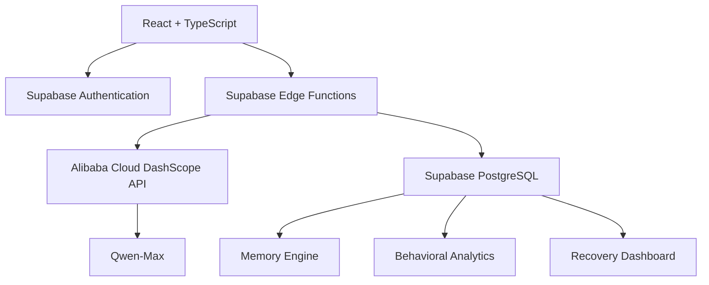

# ⚓ Anchor — MemoryAgent

**A Memory-Powered AI Accountability Companion built with Alibaba Cloud Qwen-Max.**

Anchor helps people build healthier habits by combining long-term memory, behavioral learning, and adaptive AI support. Instead of treating every conversation independently, Anchor remembers meaningful experiences, learns from user behavior, and provides personalized guidance that evolves over time.

---

## 🌍 Global AI Hackathon

**Track:** MemoryAgent

Anchor demonstrates how persistent AI memory can create more supportive, context-aware, and personalized user experiences.

---

## ✨ Features

- 🧠 Persistent cross-session memory
- 🤖 AI-powered accountability conversations
- 📈 Recovery dashboard with live progress analytics
- 💬 Intelligent chat with contextual memory retrieval
- 🔥 Streak and wellness tracking
- 📝 Daily emotional check-ins
- ⚡ Urge logging and relapse tracking
- 🎯 Personalized AI insights and recommendations
- 🔒 Secure authentication with Row-Level Security
- ⚙️ Customizable AI personality and notification preferences

---

## 🧠 MemoryAgent Implementation

Anchor satisfies the MemoryAgent requirements through four core capabilities.

### Persistent Memory

The AI remembers:

- Goals
- Triggers
- Identity statements
- Preferences
- Achievements
- Relationships
- Coping strategies
- Personal experiences

These memories persist across conversations and sessions.

### Intelligent Retrieval

Rather than sending every memory to the LLM, Anchor retrieves only the most relevant memories using:

- Importance score
- Confidence score
- Reinforcement frequency
- Recency weighting
- Memory decay

This keeps conversations accurate, efficient, and context-aware.

### Memory Reinforcement

When users naturally confirm previous information, memories become stronger over time.

Less useful memories gradually decay, while important identity memories remain permanent.

### Behavioral Learning

Anchor continuously adapts using:

- Daily check-ins
- Wellness logs
- Urge logs
- Relapse history
- Conversation patterns
- Recovery progress

The AI adjusts both recommendations and conversation style based on user behavior.

---

## 🏗 Architecture

